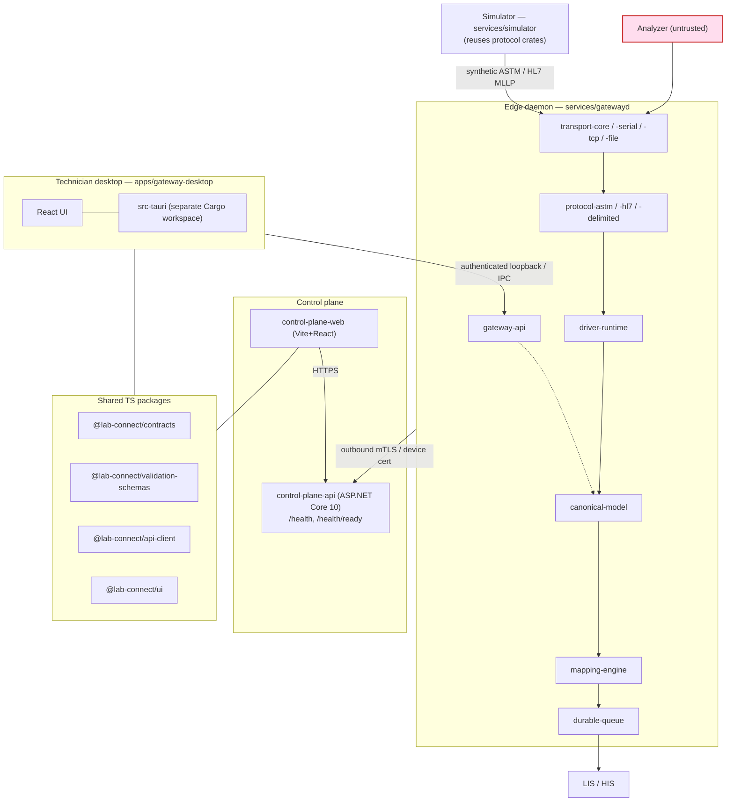

# Component Model — lab-connect

Status: Draft (Phase 0)
Date: 2026-07-18

> Scope note: This document maps runtime components to the concrete scaffold that exists
> in this repository. It is a planning artifact and makes no regulatory, clinical-validity,
> or compliance claims. All referenced data is synthetic or irreversibly de-identified.
> Successful parsing, mapping, or simulation never establishes clinical validity on its
> own.

---

## 1. Overview

lab-connect has four runtime containers plus a test/simulation tool:

1. **`gatewayd`** — the edge daemon that does the actual analyzer communication and delivery.
2. **Technician desktop app** — a local inspector/configurator; it is *not* the communication process.
3. **Control plane** — the ASP.NET Core API and the React web app for fleet management.
4. **Simulator** — a synthetic analyzer for development, conformance, and CI.

The Rust workspace root (`Cargo.toml`) declares the crates and the two Rust services as
workspace members; the Tauri desktop shell (`apps/gateway-desktop/src-tauri`) is
deliberately **excluded** as a separate Cargo project (see §7).

---

## 2. Edge daemon — `services/gatewayd`

**What it is:** a native Rust daemon, packaged as a Windows Service and macOS launchd
service. It owns port discovery, connection lifecycle, the protocol runtime, drivers, the
local database, the durable queue, the local API, telemetry, and the update client. It
**continues processing when the UI, control plane, or internet is unavailable.**

**Crates it composes (all workspace members under `crates/`):**

| Crate | Responsibility |
| --- | --- |
| `transport-core` | Transport traits/abstractions, bounded buffers, passive-capture guarantees, connection lifecycle. |
| `transport-serial` | RS-232 / USB virtual COM: port enumeration, baud/parity/flow config, reconnect, exclusive access. |
| `transport-tcp` | TCP client/server, bind controls/allowlists, keepalive, backoff, flood/oversize protection. |
| `transport-file` | Watched-file ingest: atomic detection, stable-write delay, quarantine, path allowlists. |
| `protocol-astm` | ASTM link-layer state machine (ENQ/ACK/NAK/EOT), framing, checksums, H/P/O/R/C/Q/L records. |
| `protocol-hl7` | HL7 v2 / MLLP framing and parsing/generation of required subsets. |
| `protocol-delimited` | Configurable delimited and fixed-width profiles. |
| `driver-runtime` | Loads/verifies driver packages; applies declarative extraction per model/firmware; sandboxed transforms. |
| `canonical-model` | The one normalized laboratory data model: typed IDs, exact decimals, provenance links. |
| `mapping-engine` | Validation (no clinical guessing), field/unit/terminology mapping, deduplication keys. |
| `durable-queue` | Store-and-forward outbox surviving restart and network loss; delivery attempts, dead letters. |
| `gateway-api` | The gateway's local authenticated API surface (consumed by the desktop app). |

**Key interfaces / boundaries:**
- **Southbound (untrusted):** transport adapters facing the analyzer VLAN. Passive by
  default; capture-only mode cannot transmit.
- **Northbound to LIS/HIS:** delivery via LIS/HIS adapter (REST first; then HL7 v2).
- **Local API (`gateway-api`):** authenticated loopback surface for the technician desktop.
- **Cloud channel:** outbound mTLS / device certificate to the control plane; no raw
  device credentials leave the edge.
- **Local persistence:** SQLite for configuration, raw/parsed messages, outbox,
  acknowledgements, dedupe keys, and audit.

---

## 3. Technician desktop app — `apps/gateway-desktop`

**What it is:** a Tauri 2 + React + TypeScript app (`@lab-connect/gateway-desktop`),
local-only by default. It talks to `gatewayd` over the authenticated loopback API
(`gateway-api`) or Tauri IPC. Its Rust shell lives in `apps/gateway-desktop/src-tauri`.

**Responsibilities:** first-run security, port discovery, add device, capture-only mode,
raw/parsed views, mapping review, fixture replay, validation, and redacted diagnostic-bundle
export. It consumes shared TypeScript packages: `@lab-connect/ui`,
`@lab-connect/api-client`, `@lab-connect/contracts`, `@lab-connect/validation-schemas`.

### 3.1 "The UI is not the communication process" rule

This is a hard architectural boundary, not a convenience. **The desktop app never talks to
an analyzer.** All device communication, framing, parsing, normalization, queuing, and
delivery happen inside `gatewayd`. The desktop app is purely a **local client of the
gateway's API** — it configures, observes, and exports.

Consequences:
- Closing the UI, or the UI crashing, does not interrupt analyzer processing or delivery.
- The UI cannot bypass gateway safety posture (e.g. it cannot make a capture-only device
  transmit).
- Device credentials and raw payloads live in `gatewayd`; the UI sees only what the API
  exposes (redacted by default; sensitive access requires explicit role + reason).

---

## 4. Edge-continues-during-outage

Because `gatewayd` is a standalone service and the pipeline is **persist-before-process**
with a `durable-queue` outbox, the edge keeps functioning when the desktop UI, the control
plane, or the internet is down:

- Incoming analyzer bytes are stored raw before interpretation, then parsed/normalized/queued
  locally.
- Results wait in the durable outbox and are delivered when the LIS/HIS path recovers;
  idempotency/dedupe keys prevent duplicate delivery on retry.
- Control-plane connectivity is for management and telemetry only; losing it does not stop
  the local receive → persist → parse → normalize → validate → map → dedupe → queue →
  deliver/hold pipeline.

---

## 5. Control plane

### 5.1 API — `services/control-plane-api`

**What it is:** an ASP.NET Core 10 modular-monolith backend (`LabConnect.slnx`), with an
xUnit test project at `services/control-plane-api.Tests`. Today it is a minimal scaffold
exposing **only** liveness/readiness endpoints:

- `GET /health` → PHI-free `{ status: "ok", ... }`
- `GET /health/ready` → PHI-free `{ status: "ready", ... }`

**Planned responsibilities** (later phases): tenant/site/lab/user/role model + OIDC,
gateway enrollment, device inventory, fleet health, configuration versions, driver
registry, mapping approvals, audit, and update channels. Backed by PostgreSQL and object
storage. Operational telemetry is separated from clinical payloads.

### 5.2 Web — `apps/control-plane-web`

**What it is:** a Vite + React app (`@lab-connect/control-plane-web`) for fleet, drivers,
mappings, approvals, users, audit, and monitoring. It consumes `@lab-connect/api-client`,
`@lab-connect/contracts`, and `@lab-connect/validation-schemas`. **The browser never
receives raw device credentials** — it works against the control plane API only.

---

## 6. Simulator — `services/simulator`

**What it is:** a Rust CLI (a workspace member) that plays a synthetic analyzer for the
first vertical slice, conformance, and CI. It drives ASTM link-layer states and HL7 MLLP
and injects faults: malformed frames, lost ACK, NAK/retry, duplicates, corrections,
timeouts, disconnects, host queries. It reuses the same protocol crates the gateway uses,
so simulated traffic exercises real code paths. Synthetic data only.

---

## 7. Why `src-tauri` is a separate workspace

`apps/gateway-desktop/src-tauri` is its **own Cargo project** and is listed under
`exclude` in the root `Cargo.toml`, so it is not a member of the main Rust workspace.
Rationale:

- **Different target and toolchain profile.** The Tauri shell builds desktop app binaries
  with Tauri's build pipeline (bundling, capabilities, `tauri.conf.json`), which differs
  from the server/edge crates and services.
- **Dependency isolation.** Keeping the Tauri dependency graph out of the core workspace
  avoids polluting the edge/service build with UI-shell dependencies and keeps
  `Cargo.lock` resolution for the safety-critical crates independent.
- **Boundary reinforcement.** It structurally reinforces §3.1: the desktop shell is a
  client, developed and built separately from `gatewayd` and the communication crates.

---

## 8. Shared TypeScript packages

| Package | Role |
| --- | --- |
| `@lab-connect/contracts` | Versioned contracts/types shared across UI and API client. |
| `@lab-connect/validation-schemas` | JSON Schema / validation definitions. |
| `@lab-connect/api-client` | Typed client for the control plane and gateway APIs. |
| `@lab-connect/ui` | Shared React UI components used by both frontends. |

---

## 9. Component / dependency diagram

---

## 10. Open items

- **OPEN:** message broker choice. Start **without** a broker; add NATS or RabbitMQ only
  when a concrete workflow needs it.
- **OPEN:** docs-site tooling for `apps/docs-site` (how this documentation is rendered and
  published).
- **OPEN:** exact gateway enrollment and certificate-rotation mechanism between `gatewayd`
  and `control-plane-api`.
- **OPEN:** FHIR scope is deferred; mapping specified, no resources implemented until a
  real integration requires them.
