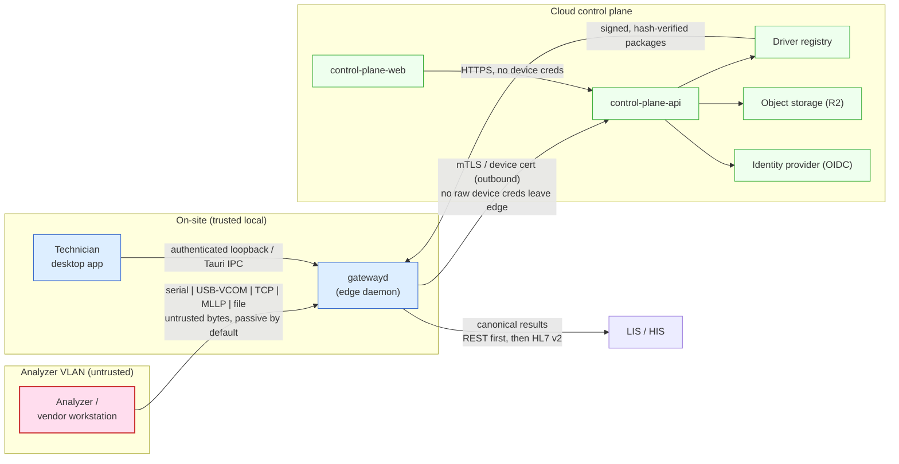
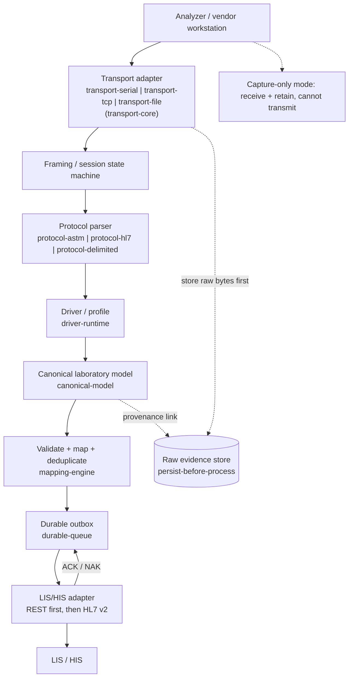

# System Context — lab-connect

Status: Draft (Phase 0)
Date: 2026-07-18

> Scope note: This document describes the system's external context and end-to-end
> data flow at the C4 "System Context" level. It is a planning artifact. It makes no
> regulatory, clinical-validity, or compliance claims. All data referenced in
> development and CI is synthetic or irreversibly de-identified. Parsing, normalizing,
> or simulating a message never establishes clinical validity on its own; clinical
> meaning is established only through the reviewed validation lifecycle owned by
> laboratory staff.

---

## 1. Purpose

lab-connect is a cross-platform middleware that connects laboratory analyzers to
LIS/HIS systems through a consistent, validated interface. The edge runs onsite as a
native Rust service; a technician desktop app configures and inspects it locally; a
cloud control plane manages a fleet of gateways, drivers, mappings, and audit.

This document defines **who and what** interacts with lab-connect (external actors and
systems), the **trust boundaries** between them, and the **end-to-end data flow** from
analyzer bytes to a delivered, acknowledged result.

---

## 2. External actors and systems

### 2.1 Human actors

| Actor | Description | Interacts with |
| --- | --- | --- |
| **Laboratory technician** | Onsite operator. Adds devices, discovers ports, runs capture-only mode, reviews raw/parsed views, replays fixtures, runs validation, exports redacted diagnostic bundles. | Technician desktop app (`apps/gateway-desktop`) over authenticated loopback / Tauri IPC. |
| **Mapping reviewer** | Reviews and approves field/unit/terminology mappings before they can affect delivery. | Control plane web (`apps/control-plane-web`). |
| **Clinical / laboratory validation approver** | Distinct role that signs off validation before a profile leaves experimental status. Never merged with mapping or operator roles. | Control plane web. |
| **Fleet operator** | Manages gateways, driver registry, update channels, fleet health. | Control plane web + control plane API. |
| **Security administrator / auditor** | Reviews audit and security events, access, and delivery evidence. | Control plane web + control plane API. |
| **Support engineer** | Time-bounded, reason-logged access for troubleshooting; sees redacted views by default. | Control plane web; receives redacted diagnostic bundles. |

### 2.2 External systems and devices

| System | Description | Relationship to lab-connect |
| --- | --- | --- |
| **Laboratory analyzer / vendor workstation** | The physical instrument or its vendor-supplied host PC. Emits ASTM, HL7 v2 (MLLP), or delimited/fixed-width messages over RS-232, USB virtual COM, TCP, or watched files. **Untrusted input source.** | Speaks to `gatewayd` transport adapters. Never trusted; default posture is passive capture. |
| **LIS / HIS** | Laboratory / hospital information system that receives results and (later, separately approved) sends orders. | Receives canonical results from `gatewayd` via LIS/HIS adapter (REST first; then HL7 v2; FHIR deferred). |
| **Cloud control plane** | The lab-connect management backend (`services/control-plane-api`) and its web UI. | Manages gateways over a secure outbound channel; never receives raw analyzer credentials. |
| **Driver registry** | Store of signed, versioned, hash-verified driver packages (data-first). | Supplies staged driver packages to gateways after signature/hash verification. |
| **Object storage (R2)** | Encrypted artifact store for signed driver packages, synthetic fixtures, release assets, approved diagnostic bundles. | Written/read by control plane; never stores identifiable clinical data. |
| **Identity provider (OIDC)** | Authenticates control plane users. | Control plane API delegates human authentication. |

---

## 3. Trust boundaries

lab-connect treats the analyzer side as hostile input and progressively narrows trust
as data moves toward delivery. The boundaries below are authoritative constraints, not
suggestions.

1. **Analyzer VLAN is untrusted.** Every byte from an analyzer or vendor workstation is
   untrusted input. Parsers must never panic on malformed input; buffers are bounded;
   capture-only mode can receive and retain bytes but **cannot transmit**. No arbitrary
   probing or control commands are sent to unidentified equipment.
2. **Gateway ↔ cloud uses mutually authenticated TLS / device certificates with
   rotation.** The gateway makes an outbound connection so most sites need no inbound
   port. **OPEN:** the exact enrollment and certificate-rotation mechanism (short-lived
   bootstrap token exchange, rotation cadence, revocation path) is not yet decided.
3. **The browser never receives raw device credentials.** Control plane web works
   against the control plane API only; device certificates and local secrets stay on the
   edge.
4. **Driver packages are signed, versioned, and hash-verified.** Packages are data-first;
   they are verified before installation and can be revoked and rolled back. A tampered
   package is rejected.
5. **Complex transformations run sandboxed.** Any advanced transform executes under
   strict CPU, memory, I/O, and time limits; the default is no executable code. No
   unrestricted scripting.
6. **PHI / result payloads are separated from operational telemetry.** Patient and result
   payloads never appear in metrics labels, telemetry, logs, crash reports, or support
   bundles. Telemetry defaults to minimal collection.

---

## 4. End-to-end data flow

The processing pipeline is **persist-before-process**: raw bytes are stored before any
interpretation, so every downstream artifact links back to the exact raw payload. A
result carries identifiers linking it to raw bytes, parser/driver version, mapping
version, validation decision, delivery attempt, and acknowledgement.

Stages (matching the logical architecture in `DEVELOPMENT_PLAN.md` §2.1):

1. **Analyzer** emits a message on a physical/logical channel.
2. **Transport adapter** (`transport-serial` | `transport-tcp` | `transport-file`, over
   `transport-core`) receives bytes with bounded buffers and safe passive capture.
3. **Framing / session state machine** assembles frames (e.g. ASTM ENQ/ACK/NAK/EOT,
   STX/ETX, checksums, multi-frame reassembly; HL7 MLLP framing).
4. **Protocol parser** (`protocol-astm` | `protocol-hl7` | `protocol-delimited`) produces
   a lossless intermediate representation, preserving unknown fields and raw records.
5. **Driver / profile** (`driver-runtime`) applies the device profile's declarative
   extraction rules for the identified model/firmware.
6. **Canonical laboratory model** (`canonical-model`) — one normalized data model with
   strongly typed IDs, exact decimals, and provenance.
7. **Validate + map + deduplicate** (`mapping-engine`) — canonical validation with no
   clinical guessing, reviewed mappings, idempotency/deduplication keys.
8. **Durable outbox** (`durable-queue`) — store-and-forward that survives restart and
   network loss; the edge keeps working while the LIS/HIS or cloud is unavailable.
9. **LIS/HIS adapter** delivers to the LIS/HIS (REST first; then HL7 v2), tracks delivery
   attempts, acknowledgements, retries, and dead letters.

**OPEN:** message broker choice. The edge and control plane start **without** a broker;
NATS or RabbitMQ is added only when a concrete workflow demonstrates the need.

**OPEN:** FHIR scope is deferred. Mapping is specified but no FHIR resources are
implemented until a real integration requires them.

---

## 5. C4 System-Context summary

At the C4 System-Context level, **lab-connect** is a single system with these external
dependencies:

- **Person → Laboratory technician** uses lab-connect (via the technician desktop app) to
  connect and validate analyzers.
- **Person → Reviewer / approver / operator / auditor / support** use lab-connect (via the
  control plane web) to manage the fleet, review mappings, approve validation, and audit.
- **Software System → Laboratory analyzer / vendor workstation** sends untrusted messages
  into lab-connect over serial, USB virtual COM, TCP, HL7 MLLP, or watched files.
- **Software System → LIS / HIS** receives validated canonical results from lab-connect
  (REST first; then HL7 v2; FHIR deferred).
- **Software System → Identity provider (OIDC)** authenticates control plane users.
- **Software System → Object storage (R2)** stores signed driver packages, synthetic
  fixtures, release assets, and approved diagnostic bundles.

Internal container boundaries (edge daemon, technician desktop, control plane API + web,
simulator) and their mapping to crates/packages/projects are detailed in
[`component-model.md`](./component-model.md).

**OPEN:** docs-site tooling (how `apps/docs-site` renders and publishes this
documentation) is not yet chosen.
